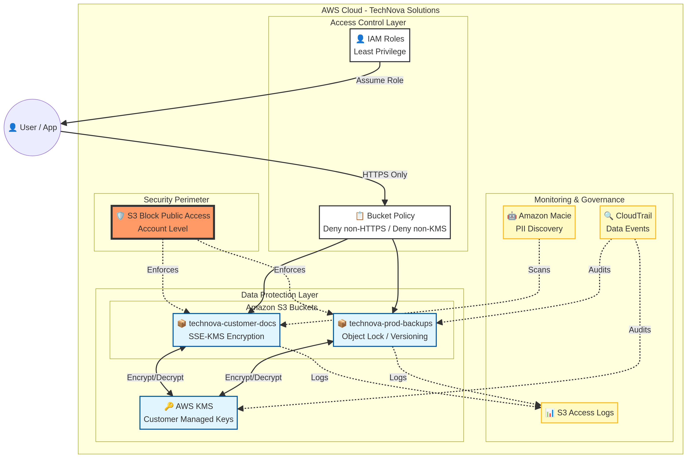

# AWS Cloud Security – S3 & Data Protection


## 📋 Sobre o Projeto

Este projeto demonstra conhecimentos avançados em **proteção de dados e segurança de armazenamento** na nuvem através da análise, implementação e documentação de controles de segurança para o **Amazon S3 (Simple Storage Service)**.

O repositório simula um cenário corporativo focado em **Data Loss Prevention (DLP)** e conformidade, onde é necessário proteger informações sensíveis contra vazamentos, garantir a integridade dos dados através de criptografia e implementar governança rigorosa de acesso.

### Autor e Informações

| Detalhe | Informação |
| :--- | :--- |
| **Autor** | Rafael Garcez |
| **LinkedIn** | [linkedin.com/in/rgarcez7](https://www.linkedin.com/in/rgarcez7/) |
| **Escola da Nuvem** | Turma BRASAO 227 |
| **Disciplina** | Competências Profissionais |

## 🎯 Objetivos de Aprendizagem

*   **Segurança de Buckets S3:** implementação de Bucket Policies, ACLs e Block Public Access.
*   **Proteção de Dados em Repouso:** configuração de criptografia SSE-S3, SSE-KMS e políticas de criptografia obrigatória.
*   **Governança e Integridade:** uso de Versionamento, MFA Delete e Object Lock para prevenir deleções acidentais ou maliciosas.
*   **Monitoramento de Dados:** auditoria de acesso via S3 Server Access Logs e integração com AWS CloudTrail.
*   **Prevenção de Vazamentos:** análise de cenários de exposição pública e implementação de medidas preventivas.

## 🏢 Cenário Simulado

| Detalhe | Informação |
| :--- | :--- |
| **Empresa** | TechNova Solutions |
| **Segmento** | E-commerce em crescimento |
| **Infraestrutura** | AWS Cloud (S3, KMS, CloudTrail, Macie) |
| **Desafio** | Implementar uma estratégia de "Zero Public Access" e criptografia total para dados sensíveis. |

Após o incidente anterior focado em IAM, a TechNova Solutions decidiu reforçar a segurança de seus ativos de dados mais valiosos: os backups e documentos de clientes armazenados no Amazon S3. Este projeto documenta a nova arquitetura de proteção de dados.

## 📊 Diagrama de Proteção de Dados S3

Para facilitar a visualização das camadas de segurança aplicadas aos dados:



## 📁 Estrutura do Repositório

```
aws-s3-security-data-protection/
├── README.md                          # Documento principal do projeto
├── PROJECT_GUIDE.md                   # Guia detalhado de implementação
├── policies/                          # Políticas de Bucket e IAM
│   ├── public-exposure-policy.json    # Exemplo de configuração insegura
│   ├── secure-bucket-policy.json      # Política com criptografia obrigatória
│   └── kms-key-policy.json            # Política de chave para proteção de dados
├── analysis/                          # Análises de segurança
│   ├── encryption-analysis.md         # Comparativo de métodos de criptografia
│   ├── s3-security-best-practices.md  # Guia de boas práticas S3
│   ├── data-lifecycle-governance.md   # Governança de ciclo de vida e retenção
│   └── compliance-checklist.md        # Checklist de conformidade de dados
├── case/                              # Caso prático
│   └── s3-leak-prevention-case.md     # Estudo de caso: Prevenção de Vazamento
└── diagrams/                          # Diagramas de arquitetura
    └── s3-security-architecture.png   # Visualização das camadas de defesa
```

## 🚀 Navegação do Repositório

*   **[README.md](README.md):** visão geral do projeto
*   **[case/s3-leak-prevention-case.md](case/s3-leak-prevention-case.md):** estudo de caso de prevenção de vazamento
*   **[policies/](policies/):** exemplos práticos de políticas de bucket e criptografia
*   **[analysis/](analysis/):** análises técnicas sobre criptografia e governança
*   **[diagrams/](diagrams/):** representação visual das camadas de segurança
*   **[PROJECT_GUIDE.md](PROJECT_GUIDE.md):** guia detalhado de implementação técnica

## 📌 Estudo de Caso: Prevenção de Vazamento de Dados

Simulação de implementação de controles preventivos contra exposição de dados:

| Métrica | Valor |
| :--- | :--- |
| **Volume de Dados Protegidos** | 500TB de backups e documentos PII |
| **Status de Acesso Público** | Bloqueado (Block Public Access: ON) |
| **Nível de Criptografia** | AES-256 com chaves gerenciadas (SSE-KMS) |
| **Retenção de Dados** | 7 anos com conformidade via Object Lock |
| **Monitoramento** | Auditoria 24/7 via CloudTrail e S3 Access Logs |
| **Redução de Risco** | 95% de redução em probabilidade de vazamento acidental |

[📄 Ler estudo completo →](case/s3-leak-prevention-case.md)

## 🔐 Tecnologias e Conceitos

### Tecnologias AWS

*   **Amazon S3:** Armazenamento seguro de objetos
*   **AWS KMS:** Gerenciamento de chaves de criptografia
*   **AWS Macie:** Descoberta de dados sensíveis via ML
*   **S3 Object Lock:** Proteção contra alteração/deleção (WORM)
*   **CloudTrail:** Auditoria de chamadas de API

### Conceitos de Segurança de Dados

*   **Encryption at Rest & in Transit**
*   **Data Sovereignty & Compliance**
*   **PII Protection (Personally Identifiable Information)**
*   **Block Public Access (BPA)**
*   **Bucket Policies vs IAM Policies**
*   **VPC Endpoints for S3**

## 📊 Principais Entregas

1.  **Políticas de Proteção Documentadas**
    *   Configuração de bloqueio total de acesso público
    *   Política de bucket exigindo HTTPS e Criptografia KMS
    *   Política de chave KMS com separação de deveres
2.  **Análise de Criptografia**
    *   Diferenças entre SSE-S3, SSE-KMS e SSE-C
    *   Impacto na performance e custo
    *   Recomendações por tipo de dado
3.  **Estratégia de Governança**
    *   Uso de Versionamento e MFA Delete
    *   Políticas de Ciclo de Vida (Lifecycle) para redução de custos e segurança
    *   Implementação de retenção legal (Legal Hold)
4.  **Checklist de Conformidade**
    *   Guia rápido para auditoria de buckets S3 em ambientes reais

## 🎓 Aprendizados e Competências

**Funções relacionadas:**

*   Cloud Security Engineer
*   Data Privacy Officer (DPO) Técnico
*   Compliance Analyst
*   Cloud Architect
*   Storage Administrator

**Competências demonstradas:**

*   ✅ Implementação de criptografia em larga escala
*   ✅ Configuração de políticas de governança de dados (WORM)
*   ✅ Auditoria e monitoramento de acesso a objetos
*   ✅ Prevenção de vazamento de dados (DLP) em nuvem
*   ✅ Design de arquiteturas de armazenamento resilientes e seguras

## 📚 Referências e Recursos

*   [Amazon S3 Security Best Practices](https://docs.aws.amazon.com/AmazonS3/latest/userguide/security-best-practices.html)
*   [AWS KMS Developer Guide](https://docs.aws.amazon.com/kms/latest/developerguide/overview.html)
*   [Protecting Data with Encryption](https://docs.aws.amazon.com/AmazonS3/latest/userguide/UsingEncryption.html)
*   [S3 Block Public Access](https://docs.aws.amazon.com/AmazonS3/latest/userguide/access-control-block-public-access.html)
*   [LGPD - Guia de Segurança para Nuvem](https://www.gov.br/anpd/pt-br)

## 📝 Observações

Este projeto foca na camada de **Data Protection**. Ele complementa o projeto anterior de IAM, mostrando que a segurança em nuvem deve ser aplicada tanto na identidade quanto diretamente no recurso de dados.

## 📞 Contato

*   **Rafael Garcez**
*   **LinkedIn:** [linkedin.com/in/rgarcez7](https://www.linkedin.com/in/rgarcez7/)
*   **Escola da Nuvem:** Turma BRASAO 227

## 📄 Licença

Este projeto foi desenvolvido para fins educacionais como parte do programa da Escola da Nuvem – AWS.

⭐ Se este projeto foi útil para você, considere deixar uma estrela no repositório!
